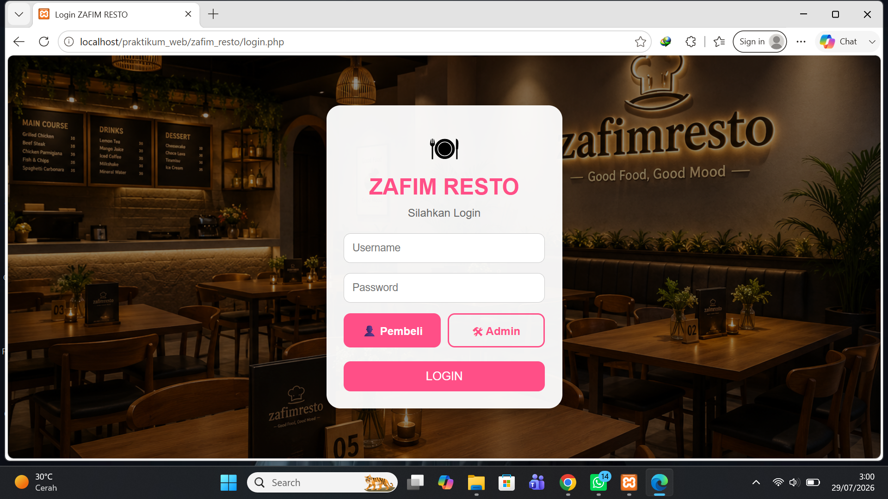
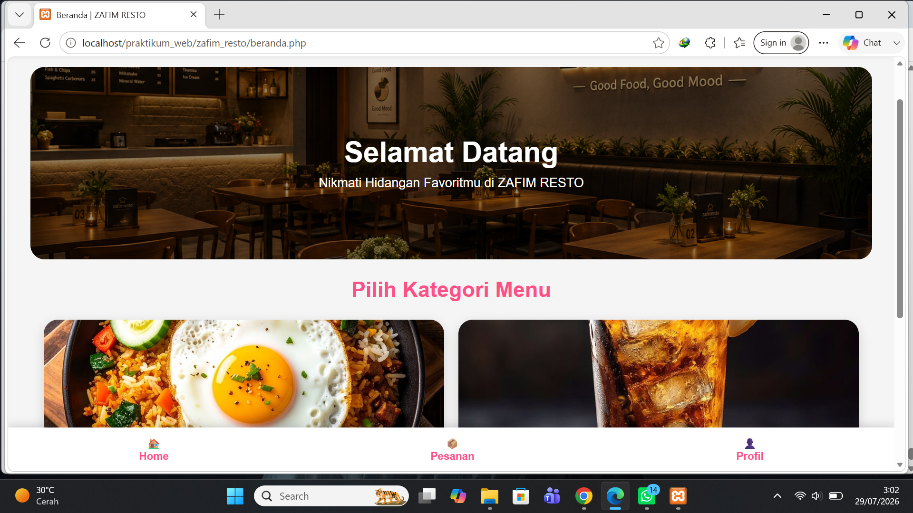
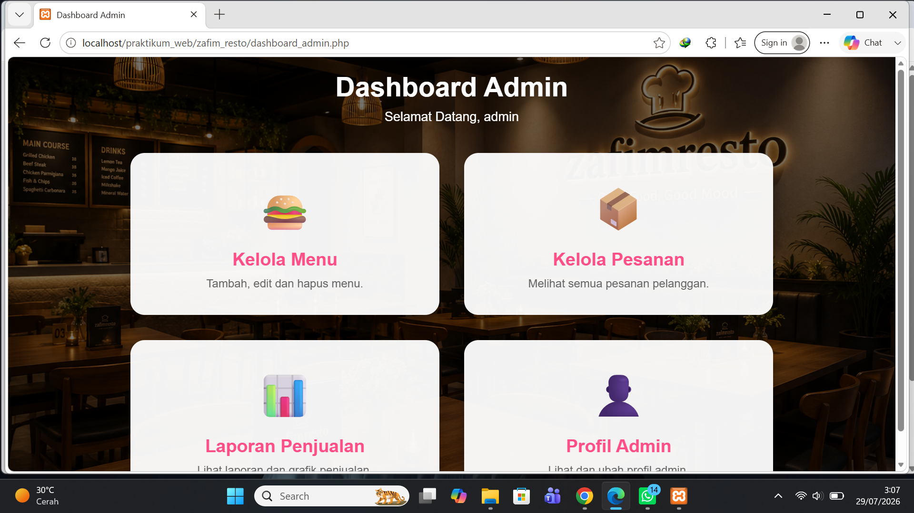
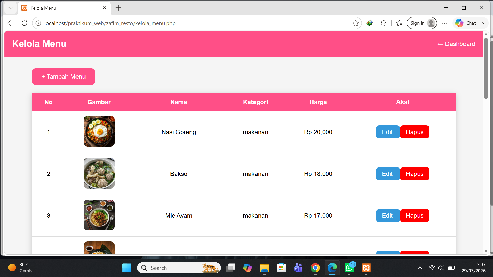
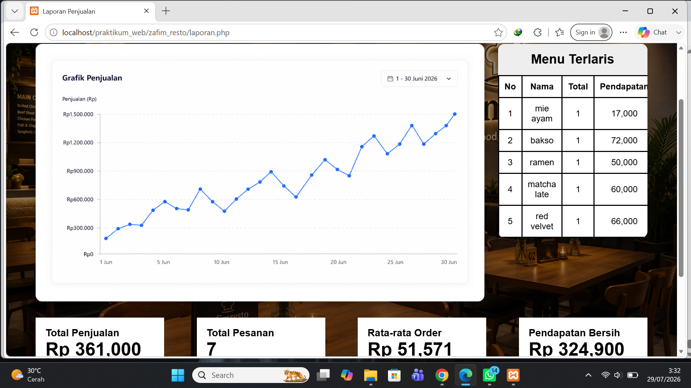

# 🍽️ Zafim Resto

A web-based restaurant management system featuring menu management, order management, sales reports, customer pages, and an admin dashboard.

## Description

Zafim Resto is a web-based restaurant management system developed using PHP and MySQL. This project helps administrators manage restaurant operations efficiently, including menu management, customer orders, and sales reports.

## Features

- Menu Management (Add, Edit, Delete)
- Order Management
- Sales Report
- Admin Dashboard
- Customer Ordering Page

## Technologies Used

- PHP
- MySQL
- HTML
- CSS
- JavaScript
- XAMPP

## Author

**Zahra Adelia Afim**

## Screenshots

### Login Page

### Customer Home

### Profile Page

### Admin Dashboard

### Menu Management

### Sales Report

